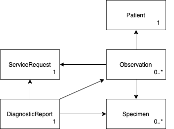

```diff
- OBS! Dokumentasjonen til Pasientens Prøvesvar (NILAR) har blitt flyttet til UtviklerPortalen
```

[Utviklerportalen](https://utviklerportal.nhn.no/informasjonstjenester/pasientens-proevesvar/)

Dette dokumentet eksisterer kun for historikk, og vil ikke bli oppdatert!

# Mapping fra XML til FHIR (R4)

### Hvordan lese dokumentet
I overskrift finner du objektnavn fra XML. I parantes har vi lagt navnet til FHIR ressurs som det i hovedsak mappes til (noen attributter hentes på tvers av XML dokument).
I noen av overskriftene har vi lag til en rolle som gir et hint om hvilken rolle ressursen har inn i FHIR ressursene. Et eksemple kan være rekvirent som brukes i Service Request.
Kolonnen "implementert" sier om vi har implementert dette i FHIR ressurser. "Delvis" betyr at det finnes en verdi, men at den ikke trenger å være endelig.
Vi oppdaterer dette etterhvert som vi får ting på plass i endepunktene.

Kolonnene value og attributes inneholder eksempelverdier fra en [svarmelding](svarmelding.xml "svarmelding"). 

### Hvordan komme med tilbakemeldinger på dokumentet
Tilbakemeldinger på dokumentet kan sendes til nilar@nhn.no.

### Levetid på dokumentet
Dette dokumentet gjelder mappingen mellom meldinger på xml-format og tilsvarende representasjon i Fhir. Det er et supplement til Fhir-profileringen, som ventes ferdig Q1 2023, og vil i en eller annen form leve parallelt med denne.

### Svarrapport 1.3 og 1.4
Mappingen er basert på svarrapport 1.4. Det er svært små endringer fra 1.3 til 1.4 og det legges til grunn at disse ikke er relevante for oppsettet nedenfor. I koden for mapping forventes de å være enkle å håndtere, men foreløpig er det ikke funnet eksempler der endringene er relevante.

|Element|Endring 1.3 -> 1.4|Konsekvens|
|-|-|-|
| Message.ServReport | Kardinalitet 1..n -> 0..1 | Array -> Nullable single, må håndtere eventuelle multipler som egne svar |
| ServReport.ServProvId | Kardinalitet 1 -> 0..1 | Triviell, nullable single |
| ServReq.Permission | Fjernet | Triviell, ignoreres |
| StructuredInfo.Type | CS -> CV | CV har noen flere properties, ekstra nullsjekk? |
| CodedInfo.Code | CS -> CV | CV har noen flere properties, ekstra nullsjekk? Foreløpig ikke i bruk |

### Testing
Testmeldinger mappes med til enhver tid gjeldenede mappingkode og legges inn i test-server. Denne er tilgjengelig og kan testes.

#### Endepunkt
- Nilar1: http://51.13.121.9:8080 Første løsning, basert på Vonk/FhirlyServer. **DEPRECATED**.
  - For endepunkt med støtte for helseID, bruk port 4141 (http://51.13.121.9:4141)).
  - Ved bruk av Postman eller andre generiske verktøy må man spesifisere at man etterspør FHIR v4 objekter, ellers får man ingen treff. Dette kan gjøres ved å legge en Accept inn i headeren:
    -  `Accept : application/fhir+json; charset=utf-8; fhirVersion=4.0`
- Nilar2: http://51.13.121.9:5212 **DEPRECATED**.
  - Krever ikke Accept header, men krever derimot header to andre headere:
    - X-Nilar-Patient: pasientens personnummer
    - X-Nilar-Requester: HPR-nummer (brukes for sjekk mot personverninnstillinger)
- Nilar3 (Privat sky): https://test.nilar.nhn.no Ny løsning, oppdateres fortløpende.
  - Se [Eksempler](https://github.com/HL7Norway/NILAR/blob/main/eksempler.md) for headers.

#### Eksempelspørringer
Se [Eksempler](https://github.com/HL7Norway/NILAR/blob/main/eksempler.md).

#### Testmeldinger
Det er mulig å sende inne egne testmeldinger, beskrivelse for dette finnes her: https://www.nhn.no/samhandlingsplattform/nilar.

## Oversikt over ressurser som brukes i NILAR



### Sammenheng mellom XML dokument og FHIR ressurser


## Message
| XML | FHIR | Kommentar | Implementert |
|-|-|-|-|
| Type |  | Dekkes av ServReport.MsgDescr |  |
| MIGversion |  | Denne mappes ikke i FHIR  |  |
| GenDate | DiagnosticReport.Issued, Observation.Issued | Tidspunktet denne instansen av svarrapporten blir sendt  | Ja |
| MsgId | DiagnosticReport.Identifier (Use = Secondary) | Må med for å kunne brukes til sporing ved spærsmål/problem rundt meldingsflyten | Ja |

*) GenDate er meldingens dato og samsvarer normalt med ServReport.IssueDate. Men i endringsmeldinger skal IssueDate beholde opprinnelig dato. GenDate gi mer info om når endringsmeldingen ble sendt og brukes som "versjonsdato". IssueDate er en klinisk viktig dato siden det er denne datoen EPJ-systemet har et forhold til. GenDate er et teknisk dato som blir produsert av meldingstjeneren. IssueDate må bevares i OtherInfo som en viktig dato

## ServReport (Diagnostic Report)
| XML | FHIR | Kommentar | Implementert |
|-|-|-|-|
| ServReport.ServType | DiagnosticReport.status [(detaljer her)](#headReportStatus) | Mappes sammen med ServReport.Status  | Ja |
| ServReport.IssueDate | DiagnosticReport.Extension.OtherInfo | Dato for opprettelse av rapporten. Beholdes selv om det kommer oppdateringer. Bruker derfor Message.GenDate for å få dato på endringer. AA: Denne datoen må vises. Må vurdere om dette skal være DiagnosticReport.effectivDate. Forslag til ledetekst "Rapportdato" (?). IY: høres ut som denne bør være egen extension. AA: Foreslår at vi avventer med egen extension. Må ha litt erfaringer fra utprøvingen. Foreløpig konklusjon: OtherOnfo, label "Rapportdato" | Ja |
| ServReport.ApprDate | DiagnosticReport.Extension.OtherInfo | Label "Godkjenningstidspunkt" | Ja |
| ServReport.Status | DiagnosticReport.status [(detaljer her)](#headReportStatus) |Mappes sammen med ServReport.ServType  | Ja |
| ServReport.CancellationCode |  | Brukes ikke | |
| ServReport.Ack |  | NA | |
| ServReport.MsgDescr | DiagnosticReport.category | Nytt kodeverk "Hovedinndeling fagområde" (avledet fra 8202) | Ja |
|  | DiagnosticReport.code | Koden fra 8202 | Ja |
| ServReport.ServProvId | Identifier |  | Ja |
| ServReport.Comment | Extention |  | Ja |
| ServReport.CodedComment |  | Extension | Ja |
| ServReport.RefDoc |  | Kan inneholde identifiserende informasjon, mappes ikke. Legger inn Comment om at RefDoc er fjernet | Ja |
| ServReport.Animal |  | NA |  |
| ServReport.Material |  | NA |  |
| ServReport.PaymentResponsible |  | NA |  |

## ServReq (ServiceRequest)
| XML | FHIR | Kommentar | Implementert |
|-|-|-|-|
| ServReport.ServReq.IssueDate | ServiceRequest.authoredOn |  | Ja |
| ServReport.ServReq.Id | DiagnosticReport.basedon, link til servicerequest, ServiceRequest.Identifier | System = "ServReqId" | Ja |
| ServReport.ServReq.ReasonAsText.Heading | Volven=8231, ServiceRequest.reasonCode -> code |  | Ja |
| ServReport.ServReq.ReasonAsText.TextResultValue | ServiceRequest.reasonCode -> text |  | Ja |
| ServReport.ServReq.ReasonAsText.TextCode |  | Ikke i bruk |  | |
| ServReport.ServReq.PaymentCat | ServiceRequest.Extension.OtherInfo | Label "Betalingskategori" | Ja |
| ServReport.ServReq.ReqComment | ServiceRequest.Note | Label "Rekvirentens kommentar" | Ja |
| ServReport.ServReq.Ack |  | NA |  |
| ServReport.ServReq.MsgDescr |  | NA, samme som i ServReport |  |
| ServReport.ServReq.RequestedPrioReport | ServiceRequest.Extension.OtherInfo | Label "Ønsket svarrapporteringsprioritet" | Ja |
| ServReport.ServReq.ReceiptDate | ServiceRequest.Extension.OtherInfo | Label "Tidspunkt for mottak" | Ja |
| ServReport.ServReq.IdByServProvider | ServiceRequest.Identifier | System = "ServReqIdByServProvider" | Ja |
| ServReport.ServReq.Reservation | ServiceRequest.Extension.OtherInfo | Label "Reservasjon" | Ja |
| ServReport.ServReq.Comment | ServiceRequest.Note |  | Ja |

## Patient (Patient)
| XML | FHIR | Kommentar | Implementert |
|-|-|-|-|
| ServReport.Patient.BasisForHealthServices | | Mappes ikke | |
| ServReport.Patient.Sex | | Mappes ikke |  |
| ServReport.Patient.DateOfBirth | | Mappes ikke |  |
| ServReport.Patient.DateOfDeath | | Mappes ikke |  |
| ServReport.Patient.Name |  | Mappes ikke | |
| ServReport.Patient.IdByServProvider | | Mappes ikke | |
| ServReport.Patient.IdByRequester | | Mappes ikke |  |
| ServReport.Patient.OffId |  | I egen "guid db" | Ja |
| ServReport.Patient.TypeOffId |  | I guid db | Ja |
| ServReport.Patient.Address | |Mappes ikke||
| ServReport.Patient.Relation | | Mappes ikke |  |
| ServReport.Patient.ResponsibleHcp | | Se [mapping av roller](#headActors) | Ja |
| ServReport.Patient.AdmLocation | | Mappes ikke |  |
| ServReport.Patient.AdditionalId | | Mappes ikke |  |
| ServReport.Patient.Address | | Mappes ikke |  |
| ServReport.Patient.InfItem | DiagnosticReport.Extension.OtherInfo | Avventer svar fra sektor | Nei |
| ServReport.Patient.Patient | | Mappes ikke |  |

## AnalysedSubject (Specimen)
| XML | FHIR | Kommentar | Implementert |
|-|-|-|-|
| ServReport.Patient.AnalysedSubject.CollectedSample.CollectedDate | Specimen.Collection.collectedDateTime. |  | Ja |
| -------------------"------------------ | Observation.Effective |   | AA: Feil Ja |
| -------------------"------------------ | DiagnosticReport.Effective (tidligste Observation.Effective) |  | Ja |
| ServReport.Patient.AnalysedSubject.CollectedSample.CollectorComment | Specimen.Note | Label "Prøvetakers kommentar" | Ja |
| ServReport.Patient.AnalysedSubject.CollectedSample.CollectorCommentCoded | Specimen.Note | Sammenstilles med CollectoComment | Ja |
| ServReport.Patient.AnalysedSubject.CollectedSample.Logistics | Specimen.Extension.OtherInfo | Label "Logistikk" | Ja |
| ServReport.Patient.AnalysedSubject.CollectedStudyProduct.Type | Specimen.Extension.OtherInfo | Label "Tatt annet objekt" | Ja |
| ServReport.Patient.AnalysedSubject.CollectedStudyProduct.ProducedDate | Specimen.Collection.collectedDateTime |  | Ja |
| ServReport.Patient.AnalysedSubject.CollectedStudyProduct.RefRelatedProd | Specimen.Extension.OtherInfo | Label "Tatt annet objekt" (sammenstilt med Type) | Ja |
| ServReport.Patient.AnalysedSubject.Type | Specimen.Type | | Ja |
| ServReport.Patient.AnalysedSubject.TypeCoded | Specimen.Type | Ikke alltid oppgitt. Implisitt med NLK-koder | Ja |
| ServReport.Patient.AnalysedSubject.Number | specimen.Extension.OtherInfo | Label "Antall prøveglass" | Ja |
| ServReport.Patient.AnalysedSubject.AnatomicalOrigin | Specimen.Collection.BodySite |  | Ja |
| ServReport.Patient.AnalysedSubject.IdByRequester | Specimen.Identifier | System = "AnalysedSubjectIdByRequester" | Ja |
| ServReport.Patient.AnalysedSubject.IdByServProvider | Specimen.Identifier, Specimen.AccessionIdentifier | System = "AnalysedSubjectId" | Ja |
| ServReport.Patient.AnalysedSubject.Comment | Specimen.Note |  | Ja |
| ServReport.Patient.AnalysedSubject.PreservMaterial | Specimen.Container.Additive |  | Ja |
| ServReport.Patient.AnalysedSubject.SampleCollInd | NA |  |  |
| ServReport.Patient.AnalysedSubject.SampleCollProc | Specimen.Collection.Method |  | Ja |
| ServReport.Patient.AnalysedSubject.SampleHandling | Specimen.Extension.OtherInfo | Label "Håndtering av prøve" | Ja |
| ServReport.Patient.AnalysedSubject.Accredited | Extension  | (midlertidig duplisert, skal bort fra Note) | Ja |
| ServReport.Patient.AnalysedSubject.AnalysedSubject | Nøstede prøver, ikke i bruk? |  |  |
| ServReport.Patient.AnalysedSubject.Pretreatment | Specimen.Extension.OtherInfo | Label "Forbehandling" | Ja |
| ServReport.Patient.AnalysedSubject.RelServProv | Specimen.Collection.Collector? |  | Ja |

## ResultItem (Observation)
| XML | FHIR | Kommentar | Implementert |
|-|-|-|-|
| ServReport.Patient.ResultiItem.Comment | Observation.Note |  | Ja |
| ServReport.Patient.ResultItem.NumResult |  |  | Ja |
| ServReport.Patient.ResultItem.NumResult.NumResultValue | Observation.Value | Quantity | Ja |
| ServReport.Patient.ResultItem.TextResultResult | Observation.Value | CodeableConcept | Ja |
| ServReport.Patient.ResultItem.TextResult.Heading | Observation.Value | CodeableConcept.Code | Ja |
| ServReport.Patient.ResultItem.TextResult.TextResultValue | Observation.Value | CodeableConcept.Text, muligens kompleks verdi, leses inn som XmlNode | Ja |
| ServReport.Patient.ResultItem.TextResult.TextCode | Observation.Value | CodeableValue.Code | Ja |
| ServReport.Patient.ResultItem.Interval | Observation.Value | Range | Ja |
| ServReport.Patient.ResultItem.DateResult | Observation.Value | dateTime | Ja |
| ServReport.Patient.ResultItem.StructuredInfo | Observation.Extension.OtherInfo | Label "Strukturert info" | Ja |
| ServReport.Patient.ResultItem.ServType | Observation.Status | Sammen med StatusInvestigation | Ja |
| ServReport.Patient.ResultItem.RefInterval.Descr | Observation.ReferenceRange.Text |  | Ja |
| ServReport.Patient.ResultItem.Investigation.Id | Observation.Code | | Ja |
| ----------------"------------------ | Observation.Category | Mapping basert på kode og kodeverk | Ja |
| ServReport.Patient.ResultItem.Investigation.Spec | Observation.Method | Må kunne skilles fra Id i Code | Ja |
| ServReport.Patient.ResultItem.Investigation.Comment | Observation.Code | Label "Comment" | Ja |
| ServReport.Patient.ResultItem.InvDate | Observation.Effective ved radiologi | AA: Tror vi skal vurdere å legge denne datoen i "OtherInfo", men det er et punkt vi kan ta opp med SAG. Og vi må ta en avskjekk med patologene om undersøkelsesdato er viktig å formidle ut | Ja |
| ----------------"-------------------- | DiagnosticReport.Effective ved radiologi (tidligste Observation.Effective) |  | Ja |
| ----------------"-------------------- | Observation.Extension.OtherInfo AA: Denne blir feil. Mappes til Obeservation.Effectice uavhengig av type undersøkelse| Label "Undersøkelsesdato" | Ja AA: Feil mapping |
| ServReport.Patient.ResultItem.DevResultInd | Observation.Interpretation |  | Ja |
| ServReport.Patient.ResultItem.IdResultItem | Observation.Identifier | Denne må vi se mer på! Denne er ikke unik. Brukes også til intern kobling av resultater. | Ja |
| ServReport.Patient.ResultItem.RefIdResultItem | Observation.hasMember |  | Ja |
| ServReport.Patient.ResultItem.StatusInvestigation | Observation.Status [(detaljer her)](#headObservationStatus)  |  | Ja |
| ServReport.Patient.ResultItem.StatusChangeDate | Observation.Extension.OtherInfo | Label "Statusendringsdato" | Ja |
| ServReport.Patient.ResultItem.DescrDate | Observation.Extension.OtherInfo | Label "Beskrivelsesdato" | Ja |
| ServReport.Patient.ResultItem.CounterSignDate | Observation.Extension.OtherInfo | Label "Kontrasignaturdato" | Ja |
| ServReport.Patient.ResultItem.MedicalValidationDate | Observation.Extension.OtherInfo | Label "Medisinsk valideringsdato" | Ja |
| ServReport.Patient.ResultItem.RefAnalysedSubject | Observation.Specimen | RefAnalysedSubject kan i følge standard inneholde referanser til flere AnalysedSubjects, men vi tror at dette ikke brukes i praksis. Vi vil derfor bare referere til ett AnalysedSubject.  | Ja |
| ServReport.Patient.ResultItem.Accredited | Extension | (midlertidig duplisert, skal bort fra Note) | Ja |
| ServReport.Patient.ResultItem.ResultItem | Observation.hasMember? Observation.derivedFrom? Observation.component? | Nøstet ResultItem | Ja |
| ServReport.Patient.ResultItem.RelServProv | Observation.Performer. Hentes fra ServReport.RelServProv om den ikke finnes |  | Ja |
| ServReport.Patient.ResultItem.DiagComment | Observation.Note | Label "Diagnostisk kommentar" AA: Tror "klinisk kommentar" er en bedre ledetekst | Ja |

## <a name="headActors"></a>Aktører knyttet til en melding
Der er flere aktører i meldingen, med ulike roller. Disse mappes ikke som ressurser, men trekkes ut og brukes til å lage ResourceReference's, som brukes relevante steder.

### Roller
| Rolle | Bruk i Fhir | Kommantar | Implementert |
|-|-|-|-|
| ResponsibleHcp ("Rekvirent") | ServiceRequest.Requester |  | Ja |
| Requester ("Mottaker") | Brukes som Requester om ResponsibleHcp mangler | Mappes ikke separat utover mulig bruk som utfyllende info for ResponsibleHcp | Ja |
| ServProvider ("Avsender") | Brukes som Performer om RelServProv mangler | Mappes ikke separat utover mulig bruk som utfyllende info for RelServProv | Ja |
| RelServProv ("Utfører/Ansvarlig") | DiagnosticReport.Performer, Observation.Performer, Specimen.Collector |  | Ja |
| CopyDest ("Kopimottaker") | NA | Mappes ikke |  |

Requester, ServProvider og CopyDest er ikke aktører knyttet til prøvesvaret, men kommunikasjonsparter ved utlevering av svaret. Disse mappes ikke i Fhir da Fhir handler om meldingens innhold og aktører knyttet til innholdet.

### Mapping
Aktører kan ha mange ulike konstallasjoner. De mappes til PractitionerRole, som igjen har en reference til Practitioner og Organization.
| XML | FHIR | Kommentar | Implementert |
|-|-|-|-|
| HCP.Inst | ResourceReference(**Organization**) |  | Ja |
| HCP.Inst.Name | ResourceReference(Organization).Identifier.Display |  | Ja |
| HCP.Inst.Id | ResourceReference(Organization).Identifier.Value |  | Ja |
| HCP.Inst.TypeId | ResourceReference(Organization).Identifier.System |  | Ja |
| HCP.Dept| ResourceReference(**Organization**) | Mappes sammen med Inst. Name konkatineres, mens Id fra Dept overstyrer Id fra Inst. | Ja |
| HCP.Inst.HCPerson | ResourceReference(**Practitioner**) |  | Ja |
| HCP.Inst.HCPerson.Name | ResourceReference(Practitioner).Identifier.Display |  | Ja |
| HCP.Inst.HCPerson.Id | ResourceReference(Practitioner).identifier.value |  | Ja |
| HCP.Inst.HCPerson.TypeId| ResourceReference(Practitioner).identifier.system |  | Ja |
| HCP.HCProf | ResourceReference(**Practitioner**) |  | Ja |
| HCP.HCProf.Type | Practitioner.Qualification) + ResourceReference(Practitioner).Identifier.Display |  | Ja |
| HCP.HCProf.Name | ResourceReference(Practitioner).Identifier.Display |  | Ja |
| HCP.HCProf.Id | ResourceReference(Practitioner).Identifier.identifier.Value |  | Ja |
| HCP.HCProf.TypeId | ResourceReference(Practitioner).Identifier.System |  | Ja |
| HCP.Address |  | NA |  |
| HCP.Address.Type |  | NA |  |
| HCP.Address.TeleAddress | PractitionerRole.Telecom |  | Ja |

## Datoer
Det er mange datoer i både xml og fhir. De fleste mappes der det er naturlig, men særlig datoer på "overordnet" nivå avledes på ulike måter fra andre datoer. Dette er en oversikt over datoer med spesiell betydning utover sin spesifikke betydning.

| Xml | Description | Fhir | Description |
|-|-|-|-|
| Message.GenDate | Meldingens dato. Denne brukes til å datere versjoner av rapporten. | DiagnosticReport.Issued | Rapportversjonens dato. |
| ServReport.IssueDate| Rapportens utstedelsesdato. Alle versjoner av rapporten har samme verdi her. Den er derfor ikke egnet til å datere versjoner. | OtherInfo. Også fallback for DiagnosticReport.Effective og Observation.Effective | Info |
| ServReq.IssueDate | Rekvisisjonsdato | ServiceRequest.AuthoredOn | |
| AnalysedSubject.CollectedSample.CollectedDate | Prøvetakingsdato. Brukes som grunnlag for å angi gyldighetstidspunkt Observation. | DiagnosticReport.Effective, Observation.Effective| Hvilket tidspunkt gjelder denne Observation. Observasjoner innen en rapport kan ha ulik effective, den eldste av disse brukes som DiagnosticReport.Effective. |
| ResultItem.InvDate | Undersøkelsesdato. Denne brukes som gyldighetstidspunkt for Observation når det ikke foreligger prøvetakingsdato (f.eks. røntgen). | DiagnosticReport.Effective, Observation.Effective | Samme som over. |

**Merk**
- Dersom ingen av kildene for Observation.Effective har verdi brukes meldingsdato (GenDate). IYR: Dette er feil, her skal ServReport.IssueDate vært førstevalg for fallback.
- DiagnosticReport.Effective er alltid eldste Observation.Effective. Dersom ingen observation finnes (Kansellering) brukes ServReport.IssueDate eller Gendate.

## <a name="headReportStatus"></a>DiagnosticReport.Status
DiagnosticReport.Status skal være en standard Fhir kode fra Code System DiagnosticReportStatus. Verdier mappes fra en kombinasjon av  verdier fra ServType og Status i svarmeldingen:

Message/ServReport/ServType: Kodeverk 7309
Message/ ServReport/Status: Kodeverk 7306

DiagnosticReportStatus v4.3.0 (Code System)
Referansesett som benyttes i mappingen

| Code (HL7) | Visningsnavn | Definition |
|-|-|-|
| registered | Registrert | The existence of the report is registered, but there is nothing yet available|
| preliminary | Foreløpig | Verified early results are available, but not all results are final |
| final | Endelig | The report is complete and verified by an authorized person |
| amended | Endret | Subsequent to being final, the report has been modified. This includes any change in the results, diagnosis, narrative text, or other content of a report that has been issued |
| appended | Tillegg | Subsequent to being final, the report has been modified by adding new content. The existing content is unchanged |
| unknown | Ukjent | The authoring/source system does not know which of the status values currently applies for this observation. Note: This concept is not to be used for "other" - one of the listed statuses is presumed to apply, but the authoring/source system does not know which |

Mapping av verdier fra ServType og Status:

| 7306 / 7309 |	Ny (N) | Endring (M) | Kansellering (C) | Historikk (H) | Tillegg (A) |
|-|-|-|-|-|-|
| Planlagt (S) | Registrert |	Endret | Kansellert | Ukjent | Ukjent |
| Foreløpig rapport (P) | Foreløpig | Endret | Kansellert | Ukjent | Ukjent |
| Endelig rapport (F) | Endelig | Endret | Kansellert | Ukjent | Ukjent |
| Tillegg til rapport (A) | Ukjent | Tillegg |Kansellert | Ukjent | Ukjent |
| Kommentar	|||| Ikke lovlig kode på svarrapportnivå | Ikke lovlig kode på svarrapportnivå |


## <a name="headObservationStatus"></a>Observation.Status
Observation.Status skal være en standard Fhir kode fra ObservationReportStatus. Verdier mappes fra en kombinasjon av  verdier fra ServType og Status i R:Denne matcher ikke helt kodeverk 8245 "Status for resultat i svarrapportering
av medisinske tjenester". Noen koder kombineres og noen blir unknown:
Observation.Status skal være en standard Fhir kode. Denne mappes fra en kombinasjon av  verdier fra ServType og Status i svarmeldingen:

Message/ServReport/Patient/ResultItem/ServType: Kodeverk 8270
Message/ ServReport/Patient/ResultItem/StatusInvestigation: Kodeverk 8245

ObservationStatus v4.3.0 (Code System)
Referansesett som benyttes i mappingen

| Code (HL7) | Visningsnavn | Definition |
|-|-|-|
| registered | Registrert | The existence of the observation is registered, but there is no result yet available |
| preliminary | Foreløpig | This is an initial or interim observation: data may be incomplete or unverified |
| final | Endelig | The observation is complete and there are no further actions needed. Additional information such "released", "signed", etc would be represented using [Provenance](provenance.html) which provides not only the act but also the actors and dates and other related data. These act states would be associated with an observation status of `preliminary` until they are all completed and then a status of `final` would be applied. |
| amended | Endret | Subsequent to being Final, the observation has been modified subsequent. This includes updates/new information and corrections |
| appended | Tillegg | Subsequent to being final, the report has been modified by adding new content. The existing content is unchanged |
| cancelled | Kansellert | 	The observation is unavailable because the measurement was not started or not completed (also sometimes called "aborted") |
| unknown | Ukjent | The authoring/source system does not know which of the status values currently applies for this observation. Note: This concept is not to be used for "other" - one of the listed statuses is presumed to apply, but the authoring/source system does not know which |

8245 / 8270 | Ny (N) | Endring (M) | Kansellering (C) | Historikk (H) | Tillegg (A) |
|-|-|-|-|-|-|
| | Endelig | Endret | Kansellert | Endelig | Endelig |
| Revidert (1) |Ukjent | Endret | Kansellert | Endret | Ukjent |
| Foreløpig (2) | Foreløpig | Endret | Kansellert | Foreløpig | Foreløpig |
| Endelig (3) | Endelig | Endret | Kansellert | Endelig | Endelig |
| Tillegg (4) | Endelig | Endret | Kansellert | Endelig | Endelig |
| Henvisning registrert (5) | Registrert | Ukjent | Kansellert | Ukjent | Registrert |
| Prosedyre registrert/planlagt (6) | Registrert | Registrert | Kansellert | Ukjent | Registrert |
| Tildelt time (7) | Registrert | Registrert | Kansellert | Ukjent | Registrert |
| Undersøkelse gjennomført (8) | Foreløpig | Ukjent | Kansellert | Ukjent | Foreløpig |
| Diktert (9) | Foreløpig | Ukjent | Kansellert | Ukjent | Foreløpig |
| Skrevet (usignert svar foreligger) (10) | Foreløpig | Ukjent | Kansellert | Ukjent | Foreløpig |
| Signert (11) | Endelig | Endret | Kansellert | Ukjent | Endelig |
| Korrigert (usignert tilleggsbeskrivelse foreligger) (12) | Ukjent | Endret | Kansellert | Ukjent | Foreløpig |
| Signert korrigert/ tilleggsbeskrivelse foreligger (13) | Endelig | Endret | Kansellert | Ukjent | Endelig |
| Undersøkelse slettet (14) | Ukjent | Ukjent | Kansellert | Ukjent | Ukjent |
| I prosess (15) | Registrert | Registrert | Kansellert | Endelig | Registrert |


## Observation.Meta
Søkbare koder ligger litt spredt forskjellige steder i svarrapportene:
- Delvis ligger de på ulike nivåer i nøstede ResultItems
- Delvis ligger de i ulike elementer inni hvert ResultItem (Investigation og TextResult)

For å forenkle søk og finne tilhørende "moder"-observation samles en kopi alle koder funnet i et nøstet sett av ResultItems/Observations i moder-observations Meta.Tags.

## Extensions
Det arbeides ut fra et ønske om å holde bruken av Fhir extensiosn på et minimum. Det er likevel avdekket noen tilfeller der det ikke er plass i relevant Fhir ressurs for informasjon som anses viktig i fagmeldingen (xml). I tillegg er det en del strukturert informasjon i xml, der det ikke finnes noen passende Fhir-element, som har fått en foreløpig/tentativ mapping inn i diverse note-elementer i Fhir. For (noen av) disse er det rimelig å anta at det vil komme behov for extensions i stedet.

### Comment
- ServReport.Comment
- ServReport.CodedComment
- ServReport.RefDoc (note om utelatt dokument)

### Accredited
- ServReport.Accredited
- AnalysedSubject.Accredited

### DiagnosticReportRef
- Observation
  - Referanse tilbake til inneholdende DiagnosticReport.
  - 
### OtherInfo
Brukes til diverse informasjon uten egen property eller extension i Fhir. Tentativt format "Ledetekst: Innhold" (men vi har indikasjoner på at dett eikke fungerer så godt...).

## Fagområde - tillegg til utvalgte koder
- NLK: hente fagområde fra kodeverksdefinisjon
  - https://www.ehelse.no/kodeverk/laboratoriekodeverket
- NCRP: hente fagområde fra posisjon i kode
  - Sjette tegn angir modalitet, alle nukleærmedisinske har T i første tegn
  - https://www.ehelse.no/kodeverk/regler-og-veiledning-for-kliniske-kodeverk-i-spesialisthelsetjenesten-icd-10-ncsp-ncmp-og-ncrp/_/attachment/download/d876a76e-1f67-4211-8f68-e3c05a37fc0e:6ee71e82b4ce8f542d583fca6ee7d002ec39a1e6/Kodeveiledning%202021.18.12.2020.pdf
